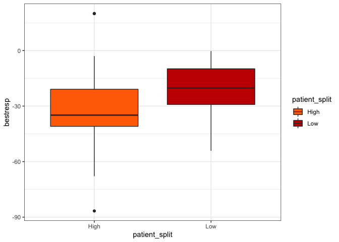
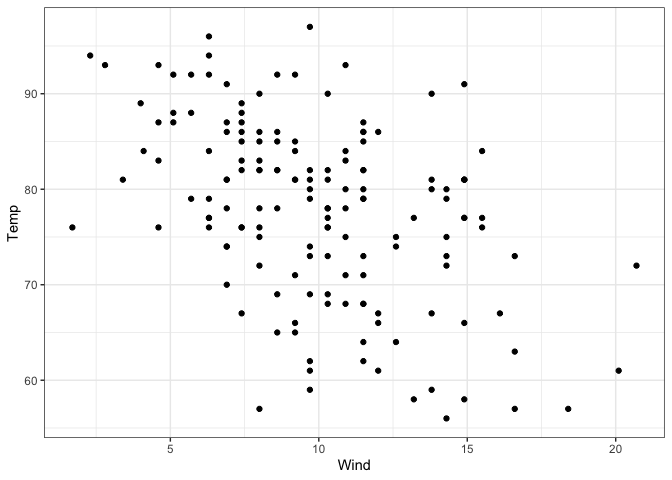
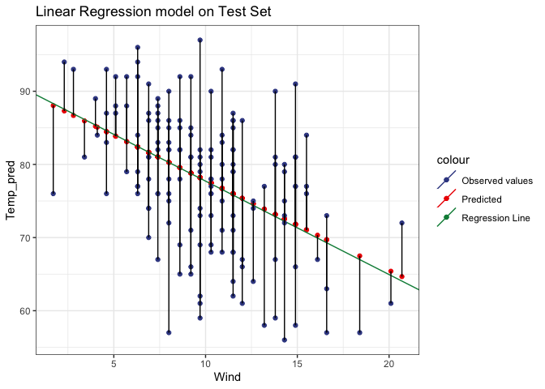
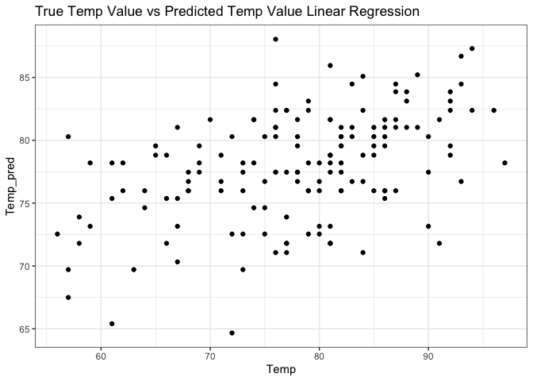
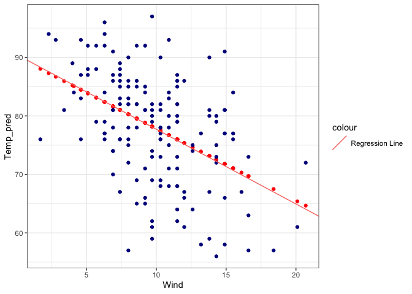
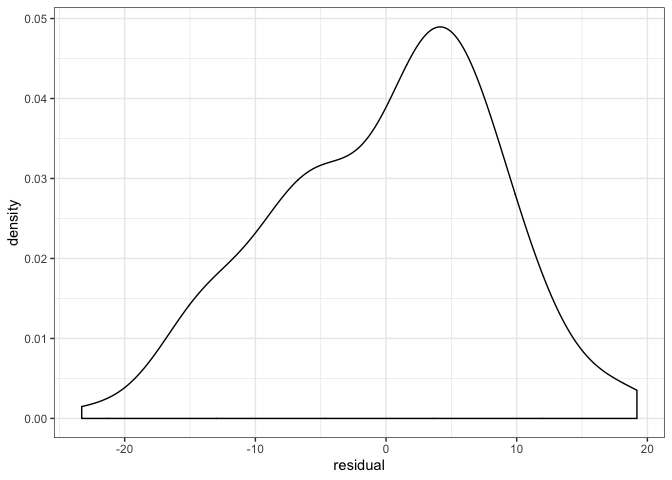

Question 1.
===========

The Zoology department of The University of Adelaide was curious to see
if Native snails and Exotic snails had the same ability to survive in
different conditions. The two different species of snail were exposed to
different relative humidities and temperatures for 1, 2, 3, or 4 weeks.
The snail data is included in the package `MASS`.

A.
--

Plot a boxplot for each relative humitidy (one new plot for 60%, 65.8%,
70.5%, and 75.8% relative humidity). The x axis of the boxplot should be
Temperature, the y axis should the the number of deaths, and the
boxplots should be filled with the species type.

    ggplot(snails, aes(x = as.factor(Temp), y = Deaths, fill = Species)) +
      geom_boxplot() +
      xlab("Temperature") +
      ggsci::scale_fill_locuszoom() +
      facet_wrap("Rel.Hum") +
      theme_bw()

B.
--

Use the appropriate statistical test to investigate whether Species A
survives better than Species B in 60% Relative Humidity regardless of
temperature. If you take temperature into account, does your conclusion
change?

Please report your answer by filling in the blanks below.

-   Null Hypothesis: There is no relationship between Species and Number
    of Deaths.

-   Test used and reason: We use Chi-squared because we are interested
    in the relationship between two categorical variables (Species and
    Death) and we want to see if they are independent.

-   P-value:

<!-- -->

    sixty_rel <- snails %>% 
      filter(Rel.Hum == 60)

    # lets make a contingency table to clarify what we want
    # at each condition there are 20 snails

    print(cont <- sixty_rel %>% 
      group_by(Species) %>% 
      mutate(total_number_snails = sum(N)) %>% 
      mutate(total_number_deaths = sum(Deaths)) %>% 
      mutate(total_number_live_snails = total_number_snails - total_number_deaths) %>% 
      dplyr::select(Species, total_number_live_snails, total_number_deaths) %>% 
      distinct() %>% 
      column_to_rownames("Species"))

    ##   total_number_live_snails total_number_deaths
    ## A                      207                  33
    ## B                      164                  76

    chisq.test(cont)

    ## 
    ##  Pearson's Chi-squared test with Yates' continuity correction
    ## 
    ## data:  cont
    ## X-squared = 20.938, df = 1, p-value = 4.743e-06

-   Reject null? (Y/N) and why: Yes, because it is unlikely that Species
    and Death are independent (Pvalue 4.743e-06)

Alternative B.
--------------

-   Null Hypothesis: There is no difference between the number of deaths
    in Species A and the number of deaths in Species B.

-   Test used and reason: We use a T-test because we are comparing the
    mean number of deaths.

-   P-value:

<!-- -->

    t.test(snails$Deaths ~ snails$Species)

    ## 
    ##  Welch Two Sample t-test
    ## 
    ## data:  snails$Deaths by snails$Species
    ## t = -3.1487, df = 68.37, p-value = 0.002432
    ## alternative hypothesis: true difference in means is not equal to 0
    ## 95 percent confidence interval:
    ##  -3.7779113 -0.8470887
    ## sample estimates:
    ## mean in group A mean in group B 
    ##        1.708333        4.020833

-   Reject null? (Y/N) and why: Yes, because it is unlikely that the
    number of deaths are the same between each species. (Pvalue
    0.002432)

Question 2.
===========

Now we will use the thyroid data. We want to know whether patients
treated with different doses of the drug sorafenib respond differently.
Split the patients into high treatment and low treatment at your
discretion. Keep in mind that a more even split in the number of
patients in each group is better.

    thyroid <- thyroid %>% 
      mutate(patient_split = ifelse(avgdose > 600, "High", "Low")) %>% 
      filter(!is.na(patient_split))

A.
--

Plot a boxplot of tumor response in the two patient groups. The x axis
should be patient groups, the y axis should be tumor response.

    ggplot(thyroid, aes(x = patient_split, y = bestresp, fill = patient_split)) +
      geom_boxplot() +
      theme_bw() + 
      ggsci::scale_fill_futurama()

B.
--

Use the appropriate statistical test to investigate whether tumor
response is different between the two groups.

Please report your answer by filling in the blanks below.

-   Null Hypothesis: The mean best response between the two patient
    groups are the same.

-   Test used and reason: We use a T-test because we are comparing the
    means of bestresp.

-   P-value:

<!-- -->

    t.test(thyroid$bestresp ~ thyroid$patient_split)

    ## 
    ##  Welch Two Sample t-test
    ## 
    ## data:  thyroid$bestresp by thyroid$patient_split
    ## t = -1.7947, df = 33.165, p-value = 0.08182
    ## alternative hypothesis: true difference in means is not equal to 0
    ## 95 percent confidence interval:
    ##  -23.66390   1.47989
    ## sample estimates:
    ## mean in group High  mean in group Low 
    ##          -32.33455          -21.24254

-   Reject null? (Y/N) and why: At the arbitrarily chosen significance
    level of 0.05, we fail to reject the null hypothesis because P &gt;
    0.05. However, as Dr. Troxel mentioned in class, we are moving away
    from using an arbitrary significance level and moving towards
    embracing uncertainty, so this question was not great. Sorry!

Question 3.
===========

A
-

You want to design a new study comparing a new chemotherapy to radiation
for breast cancer. The outcome you are measuring is the reduction of
tumor size. You want a sample size of n=100/treatment arm. You expect
that the average difference in tumor size reduction in the chemotherapy
group vs radiation group will be 2, and standard deviation will be equal
to 5. What power will this yield?

    power.t.test(n=100, delta=2, sd=5, power=NULL)

    ## 
    ##      Two-sample t test power calculation 
    ## 
    ##               n = 100
    ##           delta = 2
    ##              sd = 5
    ##       sig.level = 0.05
    ##           power = 0.8036466
    ##     alternative = two.sided
    ## 
    ## NOTE: n is number in *each* group

B
-

If we wanted 90% power, what sample size would we need? (Keeping all
other parameters the same)

    power.t.test(n=NULL, delta=2, sd=5, power=0.90)

    ## 
    ##      Two-sample t test power calculation 
    ## 
    ##               n = 132.3106
    ##           delta = 2
    ##              sd = 5
    ##       sig.level = 0.05
    ##           power = 0.9
    ##     alternative = two.sided
    ## 
    ## NOTE: n is number in *each* group

C
-

How would the power be affected by decreasing the standard deviation?

Power decreases with increasing standard deviation.

D
-

How would the power be affected by increasing the effect size?

The power increases by increasing the effect size.

Question 4.
===========

Now we will use the Mauna Loa C02 concentrations dataset. We will
predict the response of the Temperature based on Wind.

A reminder:

### Residual

Deviation of the observed value to the estimated value.

### Here are some assumptions that linear regression makes:

-   The residuals should be close to zero.
-   There should be equal variance around the regression line
    (homoscedasticity).
-   Residuals should be normally distributed.
-   Independent variables and residuals should not be correlated.

<!-- -->

    data(airquality)

This is the data we will fit a linear model to.

A.
--

Create and fit a linear model to predict Temperature from Wind.

    linear_regression <- lm(Temp ~ Wind, data = airquality)

B.
--

Vizualize how your model performed on the data by plotting the
regression line on top of the data points.

    linear_predict <- predict(linear_regression)
    plot_lin_pred <- data.frame(Temp_pred = linear_predict, Temp = airquality$Temp, Wind = airquality$Wind)

    # Extract coefficients from the model, plot the regression line on the predicted values, plot the original test values
    linear_regression$finalModel$coefficients

    ## NULL

    ggplot(data = plot_lin_pred)+
      geom_point(aes(x=Wind, y = Temp_pred, col =  "Predicted")) + 
      ggtitle("Linear Regression model on Test Set") +
      geom_abline(aes(intercept = 90.493474, slope = -1.27743, col="Regression Line")) +
      geom_point(aes(x = Wind, y = Temp, col = "Observed values")) +
      geom_segment(aes(x = Wind, xend = Wind, y = Temp,yend = Temp_pred)) +
      theme_bw() +
      ggsci::scale_color_aaas()

C.
--

Look at the residuals. Are they close to zero?

    summary(linear_regression)

    ## 
    ## Call:
    ## lm(formula = Temp ~ Wind, data = airquality)
    ## 
    ## Residuals:
    ##     Min      1Q  Median      3Q     Max 
    ## -23.291  -5.723   1.709   6.016  19.199 
    ## 
    ## Coefficients:
    ##             Estimate Std. Error t value Pr(>|t|)    
    ## (Intercept)  90.1349     2.0522  43.921  < 2e-16 ***
    ## Wind         -1.2305     0.1944  -6.331 2.64e-09 ***
    ## ---
    ## Signif. codes:  0 '***' 0.001 '**' 0.01 '*' 0.05 '.' 0.1 ' ' 1
    ## 
    ## Residual standard error: 8.442 on 151 degrees of freedom
    ## Multiple R-squared:  0.2098, Adjusted R-squared:  0.2045 
    ## F-statistic: 40.08 on 1 and 151 DF,  p-value: 2.642e-09

The median residual is 1.709 which is not too bad. But if you look at
the 1st and 3rd Quartile, as well as the max and min residuals, they are
quite large given that Temp has a range of ~40.

D.
--

Plot predicted temperature vs observed temperature. A strong model
should show a strong correlation.

    ggplot(data = plot_lin_pred) +
      geom_point(aes(x=Temp, y = Temp_pred)) +
      ggtitle("True Temp Value vs Predicted Temp Value Linear Regression") +
      theme_bw()

E.
--

Plot Wind vs predicted Temperature, and on the same plot, add Wind vs
measured Temperature, and the regression line.

    # Extract coefficients from the model
    # plot the regression line on the predicted values
    # plot the original test values

    ggplot(data = plot_lin_pred) +
      geom_point(aes(Wind, Temp_pred), color = "red") +
      geom_point(aes(Wind, Temp), color = "dark blue") +
      geom_abline(aes(intercept = 90.493474, slope = -1.27743, col="Regression Line"))  +
      theme_bw()

F.
--

Residuals should be normally distributed. Plot the density of the
residuals. Are they normally distributed? (help(residuals))

    residuals_lin <- residuals(linear_regression)
    residvpredict <- data.frame(residual = residuals_lin, Wind = airquality$Wind)

    ggplot(data=residvpredict) +
      geom_density(aes(residual)) +
      theme_bw()

G.
--

Independent variables and residuals should not be correlated. Calculate
the correlation between the Wind and the residuals.

    cor.test(residvpredict$Wind, residvpredict$residual)

    ## 
    ##  Pearson's product-moment correlation
    ## 
    ## data:  residvpredict$Wind and residvpredict$residual
    ## t = -1.4892e-15, df = 151, p-value = 1
    ## alternative hypothesis: true correlation is not equal to 0
    ## 95 percent confidence interval:
    ##  -0.1586781  0.1586781
    ## sample estimates:
    ##          cor 
    ## -1.21187e-16
