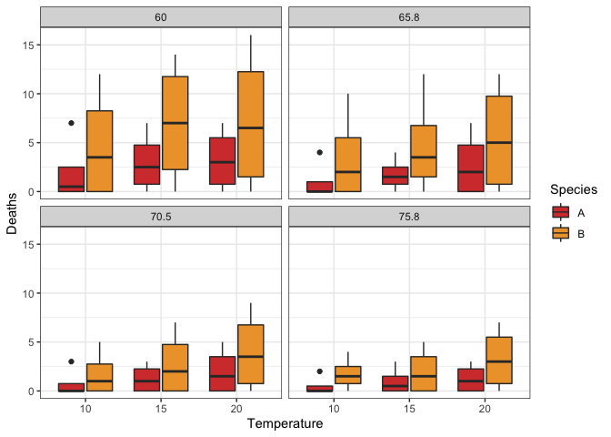

Question 1.
===========

The Zoology department of The University of Adelaide was curious to see
if Native snails and Exotic snails had the same ability to survive in
different conditions. The two different species of snail were exposed to
different relative humidities and temperatures for 1, 2, 3, or 4 weeks.
The snail data is included in the package `MASS`.

A.
--

Plot a boxplot for each relative humitidy (one new plot for 60%, 65.8%,
70.5%, and 75.8% relative humidity). The x axis of the boxplot should be
Temperature, the y axis should the the number of deaths, and the
boxplots should be filled with the species type.

B.
--

Use the appropriate statistical test to investigate whether Species A
survives better than Species B in 60% Relative Humidity regardless of
temperature. If you take temperature into account, does your conclusion
change?

Please report your answer by filling in the blanks below.

-   Null Hypothesis:

-   Test used and reason:

-   P-value:

-   Reject null? (Y/N) and why:

Question 2.
===========

Now we will use the thyroid data. We want to know whether patients
treated with different doses of the drug sorafenib respond differently.
Split the patients into high treatment and low treatment at your
discretion. Keep in mind that a more even split in the number of
patients in each group is better.

A.
--

Plot a boxplot of tumor response in the two patient groups. The x axis
should be patient groups, the y axis should be tumor response.

B.
--

Use the appropriate statistical test to investigate whether tumor
response is different between the two groups.

Please report your answer by filling in the blanks below.

-   Null Hypothesis:

-   Test used and reason:

-   P-value:

-   Reject null? (Y/N) and why:

Question 3.
===========

A
-

You want to design a new study comparing a new chemotherapy to radiation
for breast cancer. The outcome you are measuring is the reduction of
tumor size. You want a sample size of n=100/treatment arm. You expect
that the average difference in tumor size reduction in the chemotherapy
group vs radiation group will be 2, and standard deviation will be equal
to 5. What power will this yield?

B
-

If we wanted 90% power, what sample size would we need? (Keeping all
other parameters the same)

C
-

How would the power be affected by decreasing the standard deviation?

D
-

How would the power be affected by increasing the effect size?

Question 4.
===========

Now we will use the Mauna Loa C02 concentrations dataset. We will
predict the response of the Temperature based on Wind.

A reminder:

### Residual

Deviation of the observed value to the estimated value.

### Here are some assumptions that linear regression makes:

-   The residuals should be close to zero.
-   There should be equal variance around the regression line
    (homoscedasticity).
-   Residuals should be normally distributed.
-   Independent variables and residuals should not be correlated.

<!-- -->

    data(airquality)

This is the data we will fit a linear model to.

A.
--

Create and fit a linear model to predict Temperature from Wind.

B.
--

Vizualize how your model performed on the data by plotting the
regression line on top of the data points.

C.
--

Look at the residuals. Are they close to zero?

    #look at the median residual value. Close to zero is best
    #help(summary)

D.
--

Plot predicted temperature vs observed temperature. A strong model
should show a strong correlation.

E.
--

Plot Wind vs predicted Temperature, and on the same plot, add Wind vs
measured Temperature, and the regression line.

F.
--

Residuals should be normally distributed. Plot the density of the
residuals. Are they normally distributed? (help(residuals))

G.
--

Independent variables and residuals should not be correlated. Calculate
the correlation between the Wind and the residuals.
